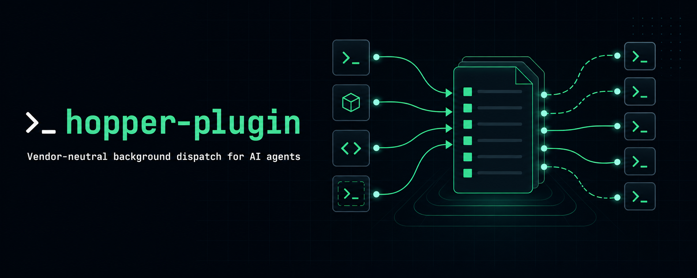
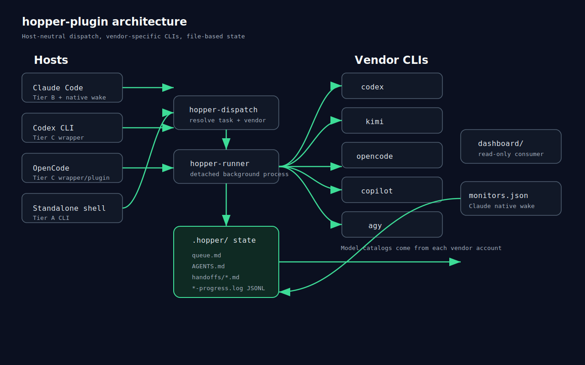
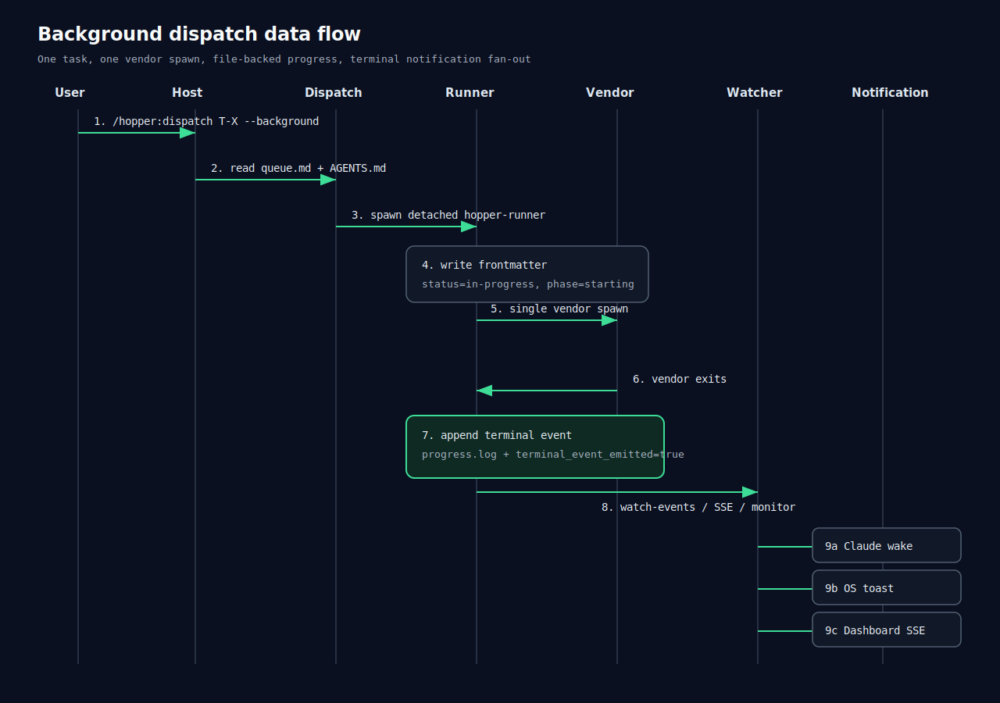

# hopper-plugin

> Vendor-neutral background dispatch for AI agents


## What

hopper-plugin is a thin plugin layer over the llm-hopper file protocol. It lets Claude Code, Codex CLI, OpenCode, Copilot CLI, Grok Build, Cursor CLI, or a standalone shell dispatch task-typed work to vendor CLIs such as codex, kimi, opencode, copilot, agy, grok, and mimo. State stays in `.hopper/` markdown and JSONL files: no hidden database, no harness reaction core, and no automatic vendor retry or fallback.

## Architecture



Seven host routes converge on `hopper-dispatch`. The dispatcher reads `.hopper/queue.md` and `.hopper/AGENTS.md`, resolves the vendor, enforces `host != vendor`, and starts `hopper-runner` for background jobs. Vendor model catalogs remain owned by each vendor account. The dashboard is a read-only consumer of the same `.hopper/` state, while `monitors/monitors.json` bridges terminal events into Claude Code native session wake.

## Data Flow



A background dispatch writes `output.md`, `output.log`, and `progress.log`. The runner appends progress JSONL events during execution and exactly one terminal event when the vendor exits. `--progress`, `--watch-events`, the Claude monitor, OS toast, and dashboard SSE all read from that same file-backed state.

## Quick Start

### Scenario 1: Dispatch to specific vendor + model

Use a task that resolves to codex, then request high reasoning from the codex adapter:

```bash
hopper-dispatch T-PROG-AUDIT --background --reasoning xhigh
hopper-dispatch --progress T-PROG-AUDIT
hopper-dispatch --result T-PROG-AUDIT
```

For vendor adapters that honor `--model`:

```bash
hopper-dispatch T-PROG-REVIEW --background --model kimi-code/kimi-for-coding
hopper-dispatch T-PROG-UI --background --model deepseek/v4-flash
```

Dispatch permissions default to `danger-full-access` so implementation tasks can edit files. If a task brief/spec explicitly says `read-only` / `只读`, hopper automatically downgrades the vendor sandbox to `read-only`; pass `--sandbox <read-only|workspace-write|danger-full-access>` to override.

### Scenario 2: Background dispatch + watch via dashboard

```bash
hopper-dispatch T-PROG-REVIEW --background
npm run dashboard:build
npm run dashboard:start
# open http://127.0.0.1:7777 and select the task's Progress tab
```

Claude Code users also get terminal events through the plugin monitor. Standalone and Codex CLI users can keep a watcher running:

```bash
hopper-dispatch --watch-events
```

### Scenario 3: Cross-host equivalence

The same task ID resolves through the same `.hopper/` routing tables regardless of host:

```bash
hopper-dispatch --resolve T-PROG-REVIEW
# Claude Code: /hopper:dispatch T-PROG-REVIEW --background
hopper-codex T-PROG-REVIEW --background
hopper-opencode T-PROG-REVIEW --background
```

## Core Skills

| Command | Purpose |
|---|---|
| `/hopper:dispatch` | Dispatch a task to its preferred vendor. |
| `/hopper:status` | Show queue summary. |
| `/hopper:result` | Fetch a completed task verdict and log tail. |
| `/hopper:models` | List cached vendor models. |
| `/hopper:probe` | Refresh vendor capability cache. |
| `/hopper:vendors` | List registered vendor adapters. |
| `/hopper:smoke` | Run the installation smoke test. |
| `hopper-watch-events` | Claude monitor that delivers terminal events. |

See [docs/cookbook.md](docs/cookbook.md) for complete workflows.

## Install

Detailed host-by-host installation is in [docs/release/INSTALL-MATRIX.md](docs/release/INSTALL-MATRIX.md).

Claude Code users:

```bash
mkdir -p ~/.claude/plugins
ln -s "$(pwd)" ~/.claude/plugins/hopper
```

Windows PowerShell:

```powershell
New-Item -ItemType SymbolicLink `
  -Path "$HOME\.claude\plugins\hopper" `
  -Target "F:\absolute\path\to\hopper-plugin"
```

Codex CLI users:

```bash
chmod +x /absolute/path/to/hopper-plugin/hosts/codex-cli/bin/hopper-codex
ln -s /absolute/path/to/hopper-plugin/hosts/codex-cli/bin/hopper-codex ~/.local/bin/hopper-codex
```

Standalone:

```bash
npm link
hopper-dispatch --smoke
hopper-dispatch --vendors
```

## Cookbook

Start with [docs/cookbook.md](docs/cookbook.md) for dispatch, progress, notification, dashboard, probe, stale-job cleanup, and multi-vendor review recipes.

## Documentation

- PRD: [docs/specs/background-progress-notification-prd-trd.md](docs/specs/background-progress-notification-prd-trd.md)
- Install matrix: [docs/release/INSTALL-MATRIX.md](docs/release/INSTALL-MATRIX.md)
- Dashboard: [dashboard/README.md](dashboard/README.md)
- Telemetry manual: [docs/specs/background-progress-notification-dogfood-telemetry-MANUAL.md](docs/specs/background-progress-notification-dogfood-telemetry-MANUAL.md)

## Status

- v1.0 (progress + terminal notifications): GA
- v1.1 (dashboard integration + OS toast + docs): GA
- v1.2 (pipe+tee + stream-parser + advanced providers): planned

## License

Apache-2.0. See [LICENSE](LICENSE).
